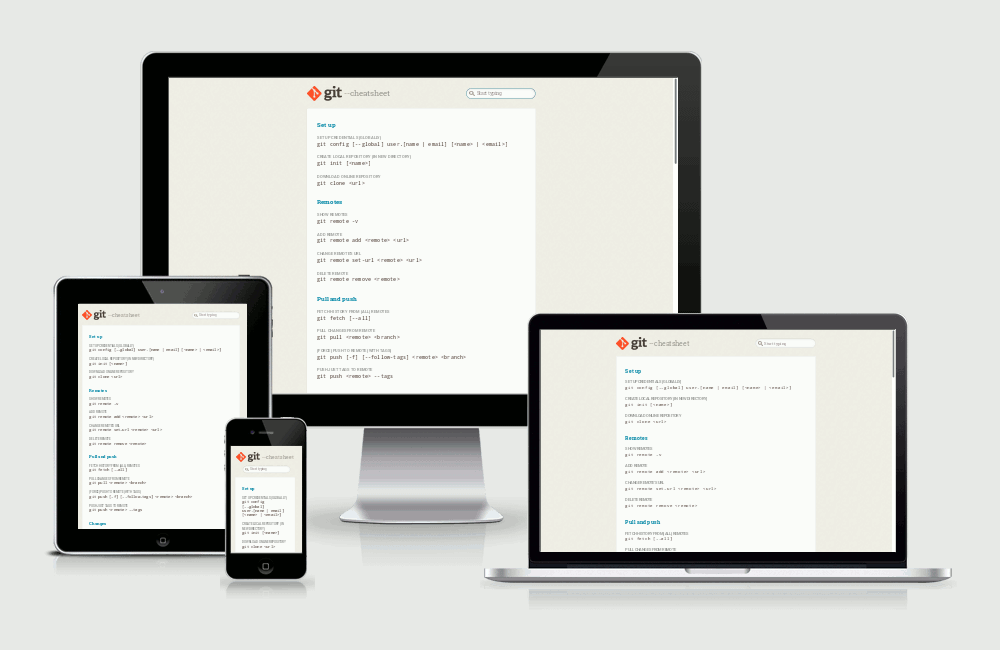

# Git cheatsheet

A filterable cheatsheet for the [Git](https://git-scm.com/) version control system. Open [the website](http://gitcheatsheet.soyguijarro.com/) and start typing to make a search. Press the Esc key to reset the search field. Commands are auto selected when you click on them for easier copying.

## Technology

The site uses vanilla JavaScript (ECMAScript 2015 or ES6) and a few functions from [Ramda](ramdajs.com). Styles are written in [Sass](http://sass-lang.com/) and automatically prefixed with [Autoprefixer](https://github.com/postcss/autoprefixer). [Babel](http://babeljs.io/) is used for transpiling and [Webpack](https://webpack.github.io/) for module bundling. JavaScript code is linted with [ESLint](http://eslint.org/) and [Airbnb's base config](https://www.npmjs.com/package/eslint-config-airbnb-base), and styles with [Stylelint](http://stylelint.io/) and its [standard config](https://github.com/stylelint/stylelint-config-standard). The site is hosted in [GitHub Pages](https://pages.github.com/) and deployed with a simple npm script.

## Motivation

The project underwent a major refactor seeking a functional style after I read the first few chapters from the excellent [Professor Frisby's Mostly Adequate Guide to Functional Programming](https://github.com/MostlyAdequate/mostly-adequate-guide). However what you'll find here is by no means a strict functional approach. The refactor mostly consisted on extracting and decoupling functions, and taking advantage of function composition and currying. Nonetheless it served me to play around with these concepts.

## Acknowledgments

The design of the site is heavily inspired by (borrowed from) the [official Git website](https://git-scm.com/). The animated screenshot at the top of this document was made possible thanks to the [am-i-responsive](http://ami.responsivedesign.is/) tool. Also, [these instructions](https://gist.github.com/domenic/ec8b0fc8ab45f39403dd) were very helpful to figure out deployment to GitHub Pages with a build step.

## License and issues

The source code of the site is released under the MIT License. The full text of the license is available in the [LICENSE file](LICENSE). If you find any errors or have suggestions for this project, please [open an issue](https://github.com/soyguijarro/git-cheatsheet/issues) and I'll do my best to help.
